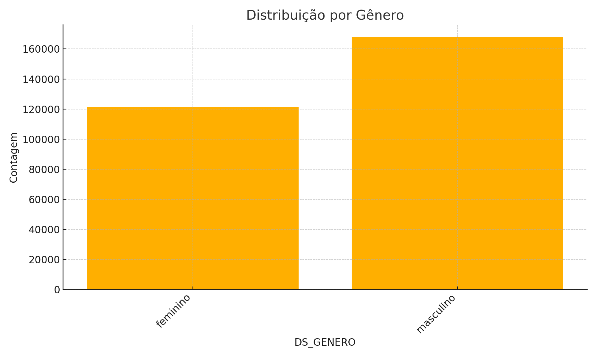
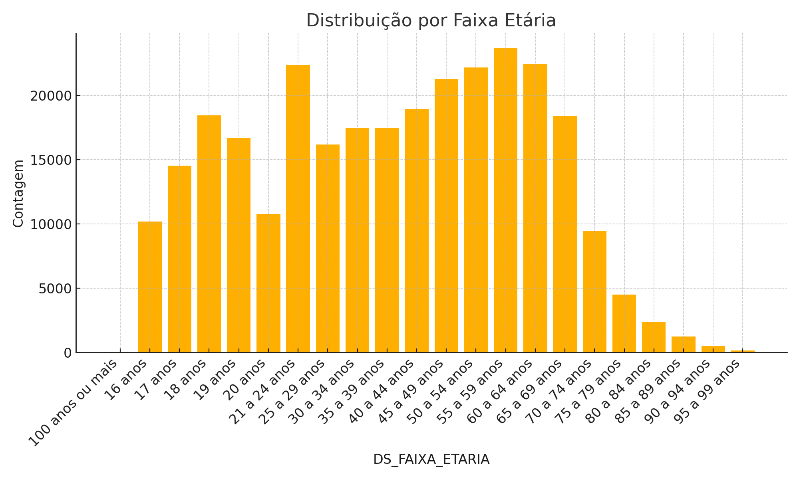
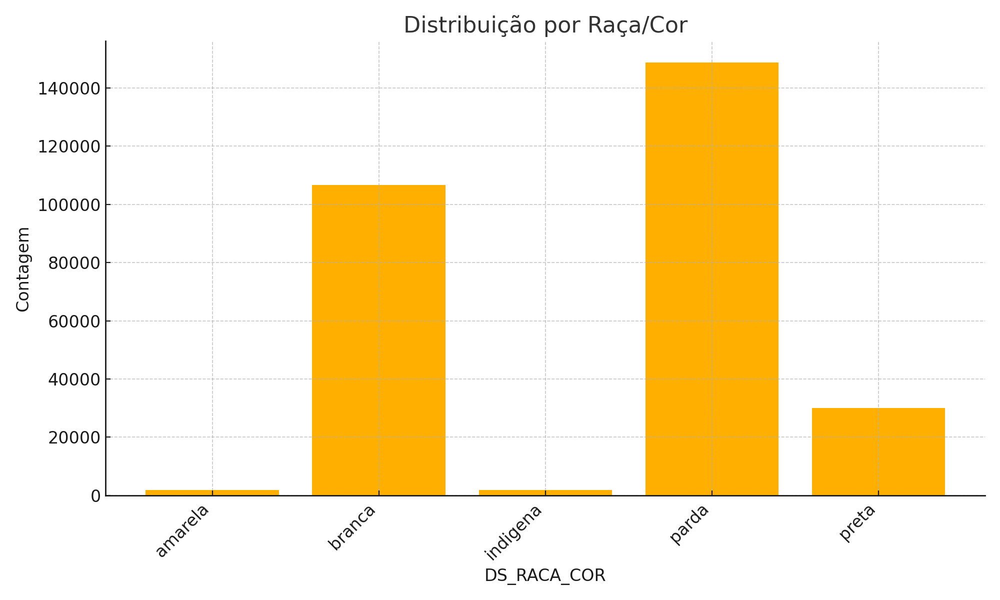
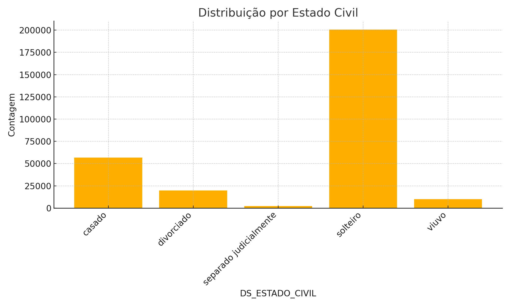
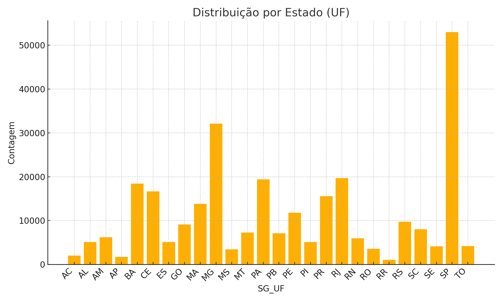

# 🐍✨ Projeto em Python — Limpeza, Preparação e Visualização de Dados  
Análises profissionais utilizando tratamento de dados, métricas e visualizações em Python.

---

## 🎯 Objetivo Geral

Este projeto tem como objetivo realizar a limpeza, padronização e análise visual de um conjunto de dados contendo informações de eleitores com deficiência.  
O processo abrange tratamento da base, organização, padronização e geração automática de gráficos descritivos, garantindo qualidade e clareza analítica.

---

# 1️⃣ Limpeza e Preparação dos Dados

## 🧹 Objetivo  
Estruturar a base `perfil_eleitor_red.csv` garantindo consistência, padronização e remoção de ruídos, preparando-a para análises estatísticas.

 

## 📌 Etapas Realizadas  

✔️ Remoção de valores nulos  
✔️ Padronização textual (uppercase)  
✔️ Remoção de categorias inválidas  
✔️ Organização das variáveis  
✔️ Preparação final para análises descritivas  

 

## 📈 Resultado  
Uma base **limpa, confiável e pronta** para análises e visualizações profissionais.

---

# 2️⃣ Análises e Visualizações

## 📊 Tipos de Gráficos Utilizados  
Gráficos de barras criados com **matplotlib**, respeitando boas práticas de clareza visual.

 

## 🖼️ Visualizações Geradas

Cada gráfico abaixo foi gerado automaticamente pelo script final deste projeto.

---

### 📌 Distribuição por Gênero  

---

### 📌 Distribuição por Faixa Etária  

---

### 📌 Distribuição por Raça/Cor  

---

### 📌 Distribuição por Estado Civil  

---

### 📌 Distribuição por Estado (UF)  

---

# 3️⃣ Principais Processos Executados  

✔️ Leitura da base reduzida  
✔️ Padronização e limpeza completa  
✔️ Remoção de inconsistências  
✔️ Análises descritivas  
✔️ Geração automatizada de gráficos  
✔️ Exportação em PNG para uso no README  

---

# 4️⃣ Tecnologias Utilizadas  

| Tecnologia | Aplicação |
|-----------|-----------|
| **Python** | Linguagem principal do projeto |
| **Pandas** | Manipulação e limpeza de dados |
| **NumPy** | Operações auxiliares |
| **Matplotlib** | Criação dos gráficos |
| **Jupyter Notebook / VSCode** | Execução e documentação |

---

# ✍️ Autoria  
Cibelly Viegas — 2025  

